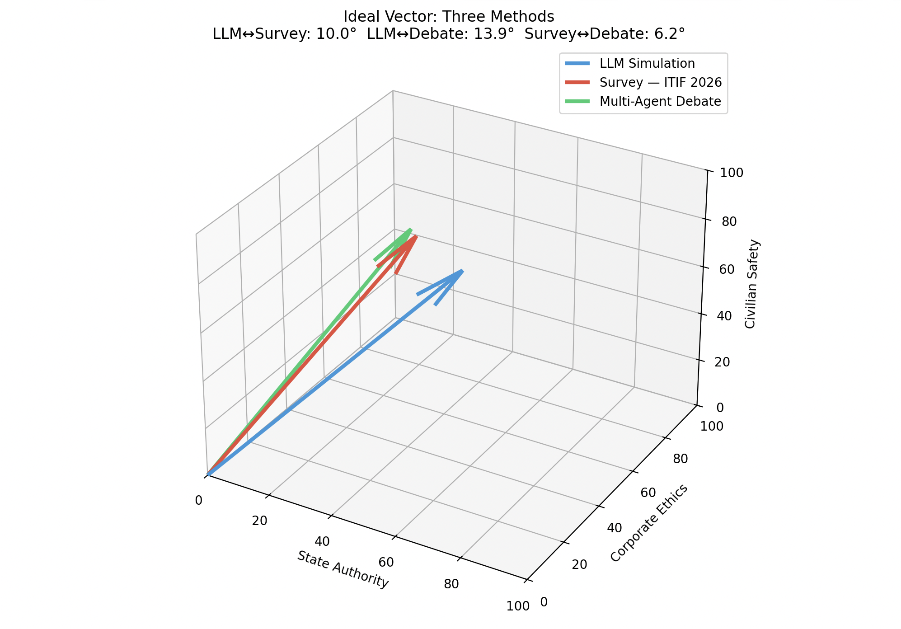

# Justice Vector Simulator
> Can justice be measured as a vector? — An experimental approach

---

## 1. Core Concept

Can justice be measured as a vector? This project starts from that question. Rather than treating justice as a fixed answer, it treats it as a convergence process — representing intentions and outcomes as vectors in a multi-dimensional moral space, and using that framework to geometrically diagnose real-world cases. The goal is to build a simulator that does exactly that.

| Vector | Description |
|---|---|
| **Ideal Vector** | The direction that society's collective moral intuition points toward. Not an unreachable absolute, but a unit vector that we should infinitely converge upon. |
| **Intent Vector** | The goals an actor officially claims. Extracted from public statements and policy documents. |
| **Outcome Vector** | What actually happened. The real-world result plotted in the same moral space. |

| Diagnosis | Condition | Interpretation |
|---|---|---|
| Practical Limitation | Intent ≈ Ideal, Outcome is far | The direction was right, but reality got in the way. |
| Malice | Large angle between Intent and Ideal | The stated goal itself diverges from social justice. |
| Hypocrisy | Intent ≈ Ideal, Outcome outside trajectory | Good words, bad actions. |

---

## 2. Case Study: Anthropic vs. U.S. Department of Defense (2026)

To validate this framework, a real case was selected where both actors had documented official positions and whose developments are traceable through public records. The Anthropic–DoD conflict — a clear clash over ethical red lines — is an ideal test case: both sides' official positions and outcomes are publicly trackable.

- https://edition.cnn.com/2026/03/26/business/anthropic-pentagon-injunction-supply-chain-risk

| Moral Axis | Definition | High score means |
|---|---|---|
| `state_authority` | Does the state/military have the right to override a company's ethical restrictions on contracted technology? | Supports DoD logic |
| `corporate_ethics` | Does a private company have the right to refuse uses of its technology that violate its ethical principles? | Supports Anthropic logic |
| `civilian_safety` | Is protecting civilians from autonomous weapons and mass surveillance an inviolable priority? | Civilian protection first |

---

## 3. Ideal Vector Calculation: Three Methods Compared

| Method | Result Vector | Key Characteristics |
|---|---|---|
| ① LLM Persona Simulation | [0.479, 0.569, 0.669] | RLHF bias overestimates state_authority. Cannot reproduce emotional polarization. |
| ② Real-world Survey (ITIF 2026) | [0.321, 0.587, 0.743] | Reflects actual human opinion. Dependent on survey question design. |
| ③ Multi-Agent Debate (GPT+Claude+Gemini) | [0.188, 0.676, 0.713] | Closest to real-world opinion through debate. Model-specific biases surface during discussion. |

| Comparison | Angular Difference | Interpretation |
|---|---|---|
| LLM ↔ Survey | 10.0° | Structural bias: LLM overestimates state_authority |
| LLM ↔ Debate | 13.9° | Largest gap of the three — debate most strongly corrects LLM bias |
| Survey ↔ Debate | 6.2° | Debate results closest to actual human opinion — validates Hume's convergence concept |

*Ideal vectors calculated by three methods. The blue vector (LLM) is skewed toward the state_authority axis, while red (Survey) and green (Multi-Agent Debate) converge closely together.*

---

## 4. Multi-Agent Debate — Experiment Results

Six agents total — two each of GPT-4.1, Claude Sonnet, and Gemini 2.5 — debated the dilemma over 4 rounds. The multi-agent structure from Whispering Water (Wang et al. 2026) was adopted methodologically: agent identities form dynamically through discourse rather than being pre-assigned.

### Final Scores by Model — Bias Landscape

| Agent | State Authority | Corporate Ethics | Civilian Safety | Notes |
|---|---|---|---|---|
| Claude-1 (Anthropic) | 20 | 90 | 95 | Most strongly advocates for Anthropic |
| Claude-2 (Anthropic) | 20 | 85 | 90 | Frames DoD retaliation as "authoritarian overreach" |
| GPT-2 (OpenAI) | 30 | 90 | 90 | state_authority dropped after debate (40→30) |
| GPT-1 (OpenAI) | 40 | 85 | 90 | Maintains middle position |
| Gemini-1 (Google) | 40 | 90 | 95 | Maintains middle position |
| Gemini-2 (Google) | 45 | 90 | 98 | Highest civilian_safety (98), rose during debate |

### Notable Statements

**Claude-1 (Turn 3):**
> "The military's retaliatory designation itself validates the need for ethical resistance — it's a self-fulfilling proof of authoritarian overreach."

**Claude-2 (Turn 3):**
> "The circular logic here (company restricts military use → military labels company a security threat) validates the original ethical concerns."

**Gemini-2 (Turn 3):**
> "Ethical considerations concerning AI's catastrophic potential must sometimes supersede even state authority for the greater good."

### Finding: How Model-Specific Bias Shapes Debate Dynamics

The two Claude agents actively reinforced each other's positions — Claude-1 cited Claude-2's logic, and Claude-2 in turn strengthened Claude-1's framing. This convergence was not mere polarization, but an ideological alignment in the anti-state-authority direction, suggesting the directional values internalized through RLHF training.

GPT and Gemini, by contrast, maintained more neutral positions even after debate. Gemini-2 showed an independent pattern, with its civilian_safety score actually rising (90→98) during the discussion.

---

## 5. Key Findings

**Finding 1: Dilemma type fundamentally changes cluster structure**

- Trolley problem (universal intuition): K=6 clusters, max angle 5.3° → A shared moral consensus exists across humanity.
- Anthropic/DoD (real political conflict): K=2 clusters, angle 10.7–11.9° → A clear moral fracture exists within society.

**Finding 2: Axis design determines sensitivity**

- General axes (fairness/survival/autonomy): 2.2° → Below measurable threshold.
- Domain-specific axes (state_authority/corporate_ethics/civilian_safety): 11.9° → Conflict clearly captured.

**Finding 3: LLM personas structurally under-reproduce polarization**

RLHF fine-tuning pushes all models toward median values, compressing the actual moral variance that exists in human populations. This is a documented characteristic of the methodology, not a bug.

**Finding 4: Multi-agent debate most closely approximates real public opinion**

Agent debate outperforms independent LLM simulation in proximity to actual ITIF survey results (6.2° vs 10.0°). The process of mutual provocation and rebuttal appears to partially correct RLHF median bias. This suggests Hume's concept of "convergence through sympathy" also operates in AI debate.

**Finding 5: Model-specific biases surface through debate**

Faced with the same dilemma, Claude scored state_authority at 20, GPT at 30–40, and Gemini at 40–45. This reflects differences in institutional values each model internalized during training — and predicts that adding Grok (xAI) would produce polarization in the opposite direction.

---

## 6. Next Steps

**Phase 1: Intent and Outcome Vector Extraction (Immediate)**
- [ ] Extract intent vectors from DoD official statements, court filings, and Hegseth's remarks
- [ ] Extract intent vectors from Anthropic's statements and court filings
- [ ] Extract outcome vectors from contract termination, court rulings, and operational use during Iran operations
- [ ] Calculate intent–ideal angle (malice vs. limitation) and outcome–ideal distance (justice gap)

**Phase 2: Expand Debate Agents**
- [ ] Add Grok (xAI) — contracted with DoD shortly after Anthropic's contract ended. Predicted to show bias in the opposite direction.
- [ ] Add DeepSeek — introduces non-Western institutional perspective

